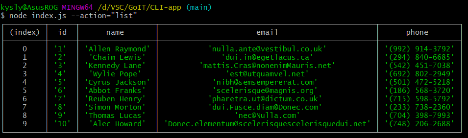
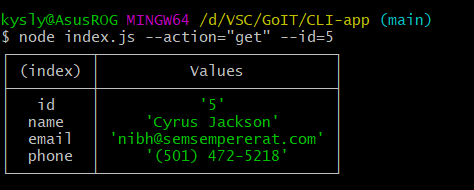
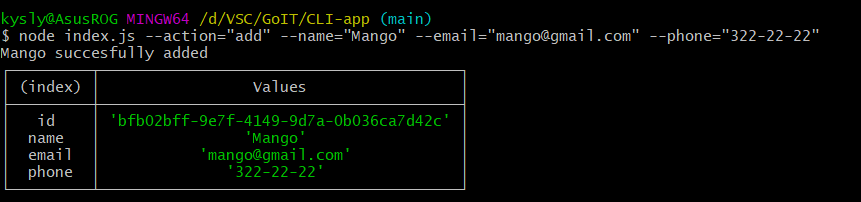
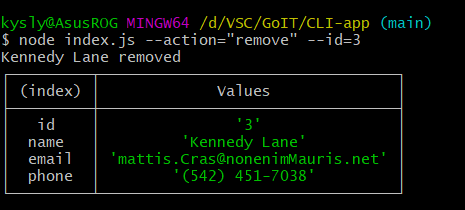

# Node.js CLI App

## Get contacts list
### node index.js --action="list"

## Get contact by id
### node index.js --action="get" --id=5

## Add new contact
### node index.js --action="add" --name="Mango" --email="mango@gmail.com" --phone="322-22-22"

## Remove contact
### node index.js --action="remove" --id=3

